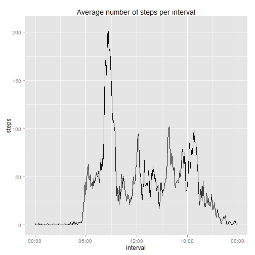

```r
library(dplyr)
library(ggplot2)
library(scales)
```

## Loading and preprocessing the data


```r
zipFilename='activity.zip'
dataFilename='activity.csv'
if (!file.exists(dataFilename)) {
	unzip(zipFilename,dataFilename)
}
data=read.csv(dataFilename,colClasses=c('integer','Date','integer'))
data$interval=as.POSIXct(
	paste(
		'2000-01-01',
		paste(
			data$interval%/%100,
			data$interval%%100,
			0,
			sep=':'
		)
	)
)
```


## What is mean total number of steps taken per day?


```r
stepsPerDay = (
	data %>% 
	group_by(date) %>% 
	summarize(steps=sum(steps))
)$steps
qplot(
	stepsPerDay,
	binwidth=2500,
	main='Histogram of total number of steps per day',
	xlab='steps per day'
)
```

 

```r
meanStepsPerDay=mean(stepsPerDay,na.rm=T)
medianStepsPerDay=median(stepsPerDay,na.rm=T)
```

Distribution of total steps per day has mean 10766.19 and median 10765.


## What is the average daily activity pattern?


```r
dataIntervals = data %>%
	group_by(interval) %>%
	summarize(steps=mean(steps,na.rm=T))
qplot(
	interval,steps,
	data=dataIntervals,
	geom='line',
	main='Average number of steps per interval'
)+scale_x_datetime(labels=date_format('%H:%M'))
```

 

```r
maxStepsInterval=dataIntervals[which.max(dataIntervals$steps),]$interval
```

Maximum number of steps is between 08:35 and 08:40.


## Imputing missing values


```r
nMissingValues=sum(is.na(data$steps))
```

Total number of missing values is 2304. They are replaced by mean values for 5-minute intervals.


```r
dataImputed=data
dataImputed$steps=ifelse(is.na(data$steps),dataIntervals$steps,data$steps)
```


```r
stepsPerDayImputed = (
	dataImputed %>% 
	group_by(date) %>% 
	summarize(steps=sum(steps))
)$steps
qplot(
	stepsPerDayImputed,
	binwidth=2500,
	main='Histogram of total number of steps per day computed from imputed data',
	xlab='steps per day'
)
```

 

```r
meanStepsPerDayImputed=mean(stepsPerDayImputed)
medianStepsPerDayImputed=median(stepsPerDayImputed)
```

Distribution of total steps per day in the imputed data has mean 10766.19 and median 10765 -- the same as in the original data. This is not surprising because missing days are replaced by average days, which increases the distribution weight at the mean.


## Are there differences in activity patterns between weekdays and weekends?


```r
dataImputed$dayOfWeekType=factor(ifelse(
	between(as.POSIXlt(dataImputed$date)$wday,1,5),
	'weekday','weekend'
))
dataIntervalsDoWType = dataImputed %>%
	group_by(interval,dayOfWeekType) %>%
	summarize(steps=mean(steps,na.rm=T))
qplot(
	interval,steps,
	facets=dayOfWeekType~.,
	data=dataIntervalsDoWType,
	geom='line',
	main='Average number of steps per interval'
)+scale_x_datetime(labels=date_format('%H:%M'))
```

 
